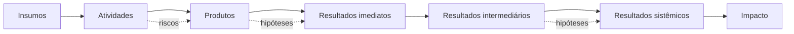
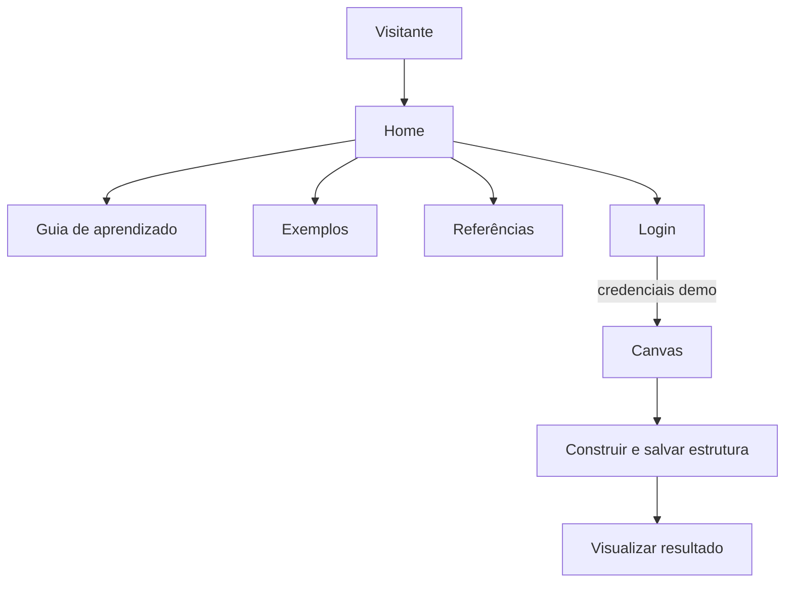
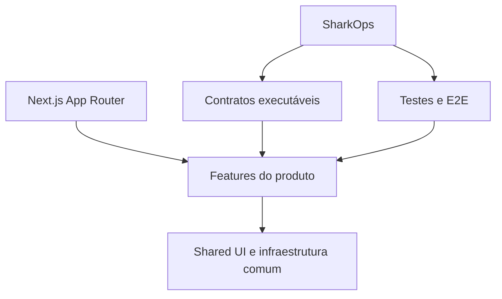

# TDM Construtor 🦈

> Uma aplicação para construir, visualizar e explicar **Teorias da Mudança** de forma estruturada, navegável e compreensível.

O TDM Construtor transforma uma ideia de impacto em um mapa causal organizado. Em vez de tratar Teoria da Mudança como um documento estático, o produto permite estruturar componentes, conectar relações, explorar resultados e apresentar a lógica da intervenção de maneira visual.

**Status da V1:** tecnicamente pronta para Release Candidate.

---

## Para quem está vendo este projeto pela primeira vez

Você não precisa conhecer Next.js, arquitetura de software ou Teoria da Mudança para entender o produto.

Pense no TDM Construtor como uma ferramenta que ajuda a responder:

- **O que temos?** → insumos
- **O que fazemos?** → atividades
- **O que entregamos?** → produtos
- **O que muda primeiro?** → resultados imediatos
- **O que muda depois?** → resultados intermediários e sistêmicos
- **Que transformação queremos alcançar?** → impacto
- **Quais riscos e hipóteses sustentam essas relações?**

O resultado é um mapa visual que ajuda equipes a transformar estratégia em uma narrativa causal verificável.

---

## O produto em uma imagem mental



A aplicação organiza essa lógica em experiências públicas de aprendizado e exemplo, além de um Canvas protegido para construção real da Teoria da Mudança.

---

## Principais jornadas



### Visitante

Pode entender o produto antes de entrar no Canvas:

- explorar exemplos;
- consultar referências;
- aprender os conceitos;
- visualizar resultados e fluxos demonstrativos.

### Pessoa autenticada no mock

Pode acessar o Canvas e trabalhar sobre a experiência principal:

- entrar usando a autenticação demonstrativa;
- criar e manipular blocos;
- preservar projetos hidratados;
- criar novas relações;
- salvar automaticamente;
- visualizar o resultado construído.

> A autenticação da V1 é **mockada e demonstrativa**. As credenciais não representam dados reais ou segredos de produção.

---

## O que torna este projeto diferente de um CRUD

O TDM Construtor não é uma coleção de telas para cadastrar registros.

Ele possui um domínio próprio:

- relações causais entre estágios;
- estrutura de Teoria da Mudança;
- Canvas interativo;
- regras de conexão;
- visualização de resultados;
- riscos e hipóteses;
- experiências públicas educacionais;
- contratos de arquitetura;
- isolamento de testes E2E;
- governança automatizada por SharkOps.

O objetivo foi construir um **produto coerente de ponta a ponta**, e não apenas demonstrar componentes isolados.

---

## Arquitetura em linguagem humana

A arquitetura foi organizada para que cada parte saiba claramente pelo que é responsável.



Em termos simples:

- **`src/app`** cuida das rotas e composição da aplicação;
- **features** concentram regras e experiências de negócio;
- **shared** contém aquilo que realmente é reutilizado;
- **contratos executáveis** impedem regressões arquiteturais importantes;
- **SharkOps** coordena verificações e mantém o histórico das grandes decisões;
- **Playwright** prova jornadas reais no navegador.

Mais detalhes: [Arquitetura do TDM](docs/ARCHITECTURE.md).

---

## Superfícies da V1

| Área | Papel |
| --- | --- |
| `/` | apresentação do produto |
| `/login` | autenticação demonstrativa |
| `/canvas` | experiência principal protegida |
| `/canvas/resultado` | resultado da construção |
| `/exemplos` | entrada para exemplos |
| `/exemplos/resultado` | exemplo de resultado |
| `/exemplos/resultado/interativo` | exemplo interativo |
| `/exemplos/visao-do-fluxo` | leitura visual do fluxo |
| `/exemplos/visao-do-fluxo/interativo` | fluxo explorável |
| `/guia-de-aprendizado` | conteúdo didático |
| `/referencias` | fundamentos e referências |

---

## Qualidade e proteção da V1

A reta final da V1 passou por uma campanha chamada **Shark Attack**.

A lógica foi:

```text
AUDIT → EVIDENCE → SMALLEST BITE → APPLY → VERIFY → GATE → CLOSEOUT
```

Em vez de grandes refactors, as mudanças foram divididas em pequenas mordidas verificáveis e reversíveis.

### Estado técnico comprovado

- ✅ SharkOps sem regressão
- ✅ ESLint com **0 erros**
- ✅ TypeScript
- ✅ E2E com cada arquivo executado em processo e servidor isolados
- ✅ build de produção com Next.js
- ✅ build sem dependência de download de Google Fonts
- ✅ artefatos Playwright fora do versionamento
- ✅ release gate fail-closed

O projeto possui warnings conhecidos que não bloqueiam a V1 e podem ser refinados de forma incremental.

---

## Como os testes estão organizados

O objetivo dos testes não é apenas “ficar verde”. Cada camada responde uma pergunta diferente.

| Camada | Pergunta |
| --- | --- |
| TypeScript | o código respeita os contratos de tipos? |
| ESLint | existem violações estáticas relevantes? |
| Contratos TDM | uma regra arquitetural crítica foi quebrada? |
| E2E de autenticação | o Canvas continua protegido e as rotas públicas continuam públicas? |
| E2E do Canvas | a experiência central preserva projeto, autosave e identidade dos blocos? |
| E2E de rotas públicas | as superfícies públicas continuam acessíveis? |
| E2E de status | erros e 404 continuam distinguíveis? |
| Build | a aplicação gera um artefato de produção válido? |

Leia: [Como testamos o TDM](docs/TESTING.md).

---

## Stack

- Next.js 16
- React
- TypeScript
- Sass Modules
- React Flow
- Playwright
- ESLint
- SharkOps, governança interna baseada em contratos executáveis

---

## Rodando localmente

```bash
npm install
npm run dev
```

Depois abra:

```text
http://localhost:3000
```

### Verificações principais

```bash
npm run lint
npm run typecheck
npm run test:e2e
npm run build
npm run shark:verify
```

---

## Estrutura de leitura recomendada

Se você é...

**Recrutador ou RH:** comece por este README e por [Produto](docs/PRODUCT.md).

**Desenvolvedor chegando agora:** leia [Arquitetura](docs/ARCHITECTURE.md), [Testes](docs/TESTING.md) e [Contribuição](docs/CONTRIBUTING.md).

**Pessoa interessada em Teoria da Mudança:** explore `/guia-de-aprendizado`, `/referencias` e os exemplos públicos.

**Eu no futuro tentando lembrar por que tudo existe:** este README é o mapa do tesouro. 🗺️

---

## Estado atual

A V1 concluiu seu **Technical Attack** e está em preparação de Release Candidate.

Próximos passos:

1. fechar a vitrine documental;
2. criar o Release Candidate;
3. publicar no GitHub;
4. conectar o repositório à Vercel;
5. executar smoke test em produção;
6. publicar a V1. 🍾

---

## Licença e uso

Consulte a configuração do repositório antes de reutilizar código ou conteúdo. Materiais conceituais e referências possuem documentação própria no projeto.
