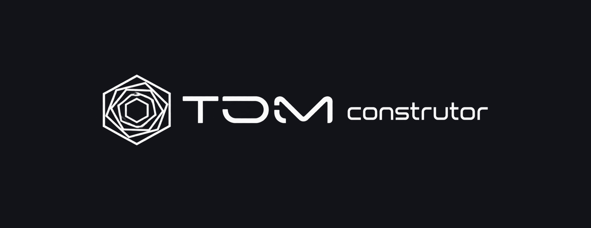
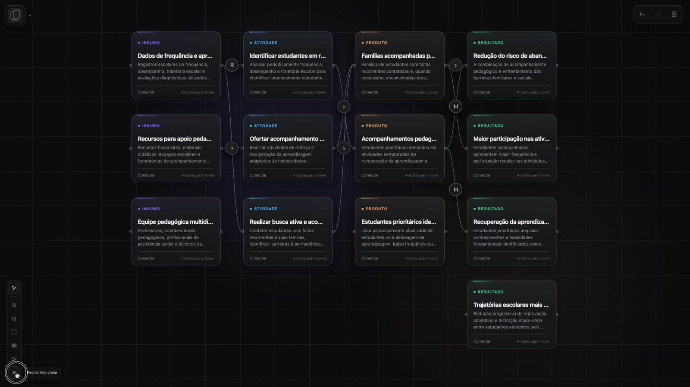
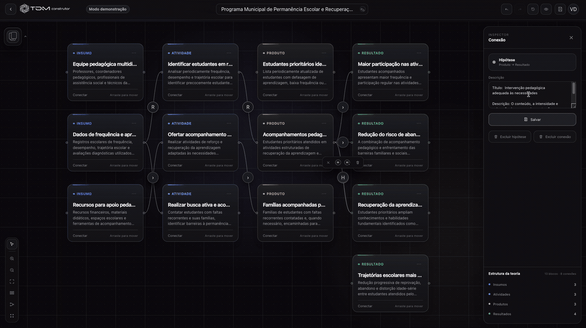
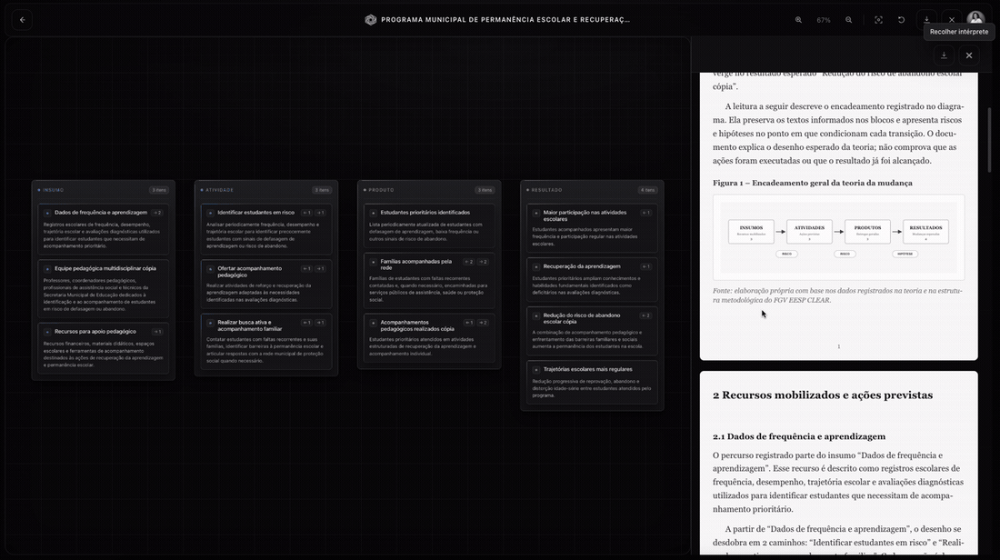
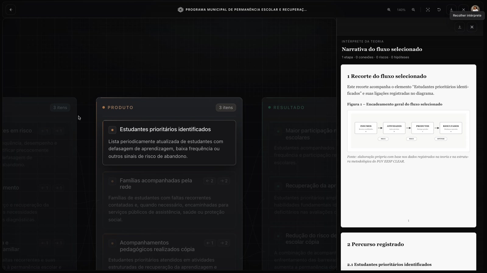
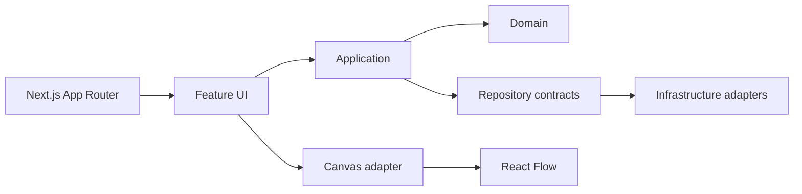

<p align="center">
  
</p>

<p align="center">
  <strong>Construa, conecte e explique Teorias da Mudança em uma experiência visual e interativa.</strong>
</p>

<p align="center">
  <a href="https://tdm-construtor.vercel.app/"><strong>Explorar produto →</strong></a>
  &nbsp;·&nbsp;
  <a href="https://tdm-construtor.vercel.app/login"><strong>Entrar como demo →</strong></a>
  &nbsp;·&nbsp;
  <a href="https://tdm-construtor.vercel.app/cadastro"><strong>Criar conta temporária →</strong></a>
</p>

<p align="center">Next.js 16 · React 19 · TypeScript · React Flow · Sass Modules · Vitest · Playwright · Vercel</p>

---

## Produto em funcionamento

O **TDM Construtor** é uma aplicação web para construir, conectar e explicar **Teorias da Mudança** de forma visual. Em vez de concentrar a teoria em documentos estáticos, o produto transforma insumos, atividades, produtos, resultados, riscos e hipóteses em um mapa causal navegável, editável e pronto para comunicação.

> **V1 funcional e publicada.** O fluxo principal está disponível em produção e pode ser experimentado sem configuração local.

<p align="center">
  <a href="https://tdm-construtor.vercel.app/">
    
  </a>
</p>

### Experimente a V1

| Experiência | Como funciona |
| --- | --- |
| **Entrar como demo** | Cria uma sessão demonstrativa privada e isolada por visitante, válida por até **24 horas**. |
| **Criar conta temporária** | Permite percorrer o fluxo de cadastro e usar a experiência autenticada; a sessão pública permanece ativa por até **24 horas**. |

**[Abrir a aplicação publicada →](https://tdm-construtor.vercel.app/)**

## Da estratégia ao mapa causal

O Canvas é a principal superfície do produto. A pessoa pode estruturar a teoria, manipular blocos, criar relações e revisar a lógica da intervenção sem perder o contexto visual.

<p align="center">
  
</p>

Na V1 estão implementados:

- criação, edição, duplicação e remoção de blocos;
- relações entre etapas guiadas por regras de domínio;
- riscos e hipóteses associados às passagens relevantes;
- organização e centralização do fluxo;
- histórico de interação com **undo/redo**;
- salvamento contínuo da estrutura e do viewport;
- área de resultado separada do ambiente de edição;
- experiências públicas de aprendizado, exemplos e referências.

## Do mapa à comunicação do resultado

O produto não termina no Canvas. A estrutura construída é convertida em uma experiência de leitura para revisar e comunicar a teoria. O **Intérprete da Teoria** organiza o conteúdo em uma narrativa estruturada e a V1 exporta diferentes representações do trabalho.

<p align="center">
  
</p>

- **PDF** e **DOCX** para narrativa e documentação;
- **PNG** e **SVG** para visualização do fluxo.

<details>
<summary><strong>Ver uma captura estática do resultado</strong></summary>
<br />
<p align="center">
  
</p>
</details>

## Decisões de engenharia

O TDM foi estruturado para que o domínio do produto não fique preso à interface, à estratégia de persistência ou a uma biblioteca externa específica.



### Domínio e persistência desacoplados

O Canvas trabalha com um **contrato de repository** para carregar e salvar projetos. As regras de aplicação dependem desse contrato, enquanto a implementação de infraestrutura fica do outro lado da fronteira. Assim, a origem dos dados pode evoluir sem reconstruir as regras de negócio ou a experiência central.

### React Flow atrás de uma fronteira

Uma camada de adaptação separa o modelo do Canvas do grafo renderizado pelo React Flow. A experiência principal preserva um modelo próprio e reduz o acoplamento à API da biblioteca.

### Arquitetura orientada a responsabilidades

```text
src/app                         rotas e composição
src/features/auth               autenticação e acesso
src/features/theory-of-change   domínio e experiências do produto
src/shared                      primitives realmente compartilhadas
```

Dentro das features, responsabilidades de **domain, application, infrastructure, server e UI** permanecem separadas quando essa fronteira protege evolução ou testabilidade.

**[Ler a documentação de arquitetura →](./docs/ARCHITECTURE.md)**

## Qualidade como parte da arquitetura

A V1 passou por uma campanha de hardening que transformou decisões importantes em **contratos executáveis**. Além dos testes tradicionais, o repositório protege pontos como:

- direção e ownership entre camadas;
- fronteiras do Canvas e da autenticação;
- uso controlado do React Flow;
- política de Sass Modules;
- continuidade de rotas públicas;
- cadastro e acesso demonstrativo;
- identidade visual e nomenclatura do produto;
- higiene do repositório;
- regressões da arquitetura consolidada.

O release gate agrega **TypeScript, lint, testes unitários, build, E2E e contratos de arquitetura** antes de considerar uma versão pronta para entrega.

### SharkOps: decisões que viram gates

Durante a evolução da V1, criei o **SharkOps**, uma camada de governança de engenharia para transformar decisões arquiteturais em verificações reproduzíveis e reduzir regressões silenciosas.

No TDM, ele integra o sistema de qualidade. O objetivo não é acumular checks, mas fazer com que decisões importantes deixem de depender apenas da memória de quem desenvolveu o produto.

## Stack

| Área | Tecnologias e práticas |
| --- | --- |
| **Frontend** | Next.js 16, React 19, TypeScript, Sass Modules |
| **Canvas** | React Flow, domínio próprio, adapters e contracts |
| **Produto** | App Router, Server Actions, autenticação, experiências públicas e protegidas |
| **Arquitetura** | Feature-based architecture, domain boundaries, repository pattern |
| **Qualidade** | Vitest, Playwright, ESLint, TypeScript, contratos executáveis, SharkOps |
| **Exportação** | PDF, DOCX, PNG e SVG |
| **Deploy** | Vercel |

## Superfícies da V1

| Rota | Experiência |
| --- | --- |
| `/` | apresentação do produto |
| `/login` | acesso existente + entrada imediata como demo |
| `/cadastro` | criação de conta temporária para experimentar a V1 |
| `/canvas` | construção visual protegida |
| `/canvas/resultado` | leitura e exportação do resultado |
| `/exemplos` | exemplos públicos |
| `/exemplos/visao-do-fluxo` | leitura visual de fluxo |
| `/guia-de-aprendizado` | conteúdo guiado sobre Teoria da Mudança |
| `/referencias` | fundamentos e referências |

## Rodando localmente

```bash
npm install
npm run dev
```

Abra `http://localhost:3000`.

### Verificação principal de release

```bash
npm run validate:release
```

Verificações individuais também estão disponíveis em `package.json` para desenvolvimento e diagnóstico.

## Documentação técnica

- [`Produto`](./docs/PRODUCT.md)
- [`Arquitetura`](./docs/ARCHITECTURE.md)
- [`Testes`](./docs/TESTING.md)
- [`SharkOps`](./docs/sharkops/SHARKOPS.md)
- [`ADRs`](./docs/architecture/adr)

---

<p align="center">
  <strong>TDM Construtor</strong><br />
  Produto independente desenvolvido por <strong>Tiala Rocha</strong>.<br />
  Frontend Engineering · Product Engineering · React · Next.js · TypeScript
</p>

<p align="center">
  <a href="https://tdm-construtor.vercel.app/"><strong>Explorar aplicação →</strong></a>
  &nbsp;·&nbsp;
  <a href="https://www.linkedin.com/in/tiala-rocha"><strong>LinkedIn →</strong></a>
  &nbsp;·&nbsp;
  <a href="https://github.com/tialaR"><strong>GitHub →</strong></a>
</p>
