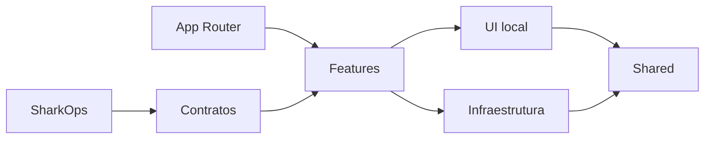

# Arquitetura — explicada sem precisar decorar o código

## Ideia central

A arquitetura protege duas coisas ao mesmo tempo:

1. o produto deve continuar funcionando;
2. o projeto deve continuar compreensível quando crescer.

Por isso as responsabilidades foram separadas e contratos importantes foram transformados em verificações executáveis.

## Golden States

O projeto usa Golden State como **baseline protegido**, não como declaração de perfeição.

- Canvas GOLDEN-STATE-v1 protege a experiência central.
- APPLICATION-GOLDEN-STATE-v1 protege o conjunto da aplicação.

Depois deles, o Post-Golden Hardening tentou deliberadamente encontrar falhas nos próprios mecanismos de proteção.

## O que o Post-Golden encontrou

- release gate que podia ficar false-green;
- E2E sensível a estado compartilhado;
- artefatos Playwright rastreados;
- build dependente de download remoto de fonte.

Todos foram tratados antes da Release Candidate.

## SharkOps

SharkOps é a camada de governança do repositório.

Ela mantém:

- estado atual;
- ledger de bites;
- manifests;
- contratos;
- gates;
- handoffs.

A ideia é simples: decisões importantes não devem existir apenas na memória de quem trabalhou no projeto.
