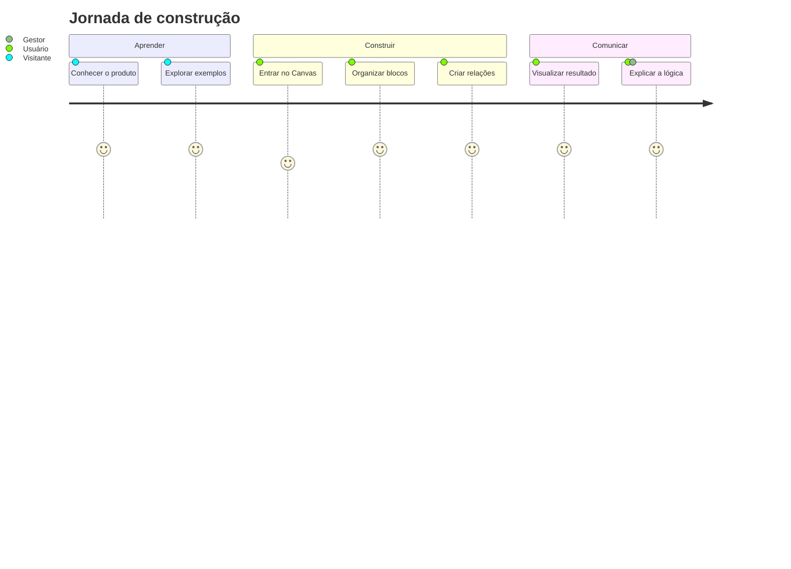

# Produto — TDM Construtor

## O problema

Teorias da Mudança frequentemente nascem em documentos extensos, planilhas ou workshops e depois se tornam difíceis de revisar, explicar e manter.

O TDM Construtor transforma essa lógica em uma experiência visual.

## Proposta de valor

Ajudar pessoas e equipes a:

- organizar causalidade;
- enxergar lacunas;
- documentar riscos e hipóteses;
- explicar a intervenção para públicos diferentes;
- revisar a lógica sem reconstruir tudo do zero.

## Personas

### Pessoa facilitadora
Conduz a construção da Teoria da Mudança e precisa organizar contribuições de várias pessoas.

### Pessoa gestora
Quer compreender rapidamente a lógica estratégica e os resultados esperados.

### Pessoa analista
Precisa revisar coerência, relações, hipóteses e evidências.

### Visitante/aprendiz
Ainda não domina Teoria da Mudança e precisa de exemplos, referências e explicações acessíveis.

## Use cases

### UC-01 — Entender Teoria da Mudança
O visitante percorre conteúdos públicos e exemplos antes de usar o Canvas.

### UC-02 — Entrar no Canvas
Uma pessoa usa a autenticação demo e acessa a superfície protegida.

### UC-03 — Construir uma teoria
A pessoa manipula blocos, cria estrutura causal e preserva o projeto.

### UC-04 — Visualizar o resultado
A estrutura construída é transformada em uma leitura visual do fluxo.

### UC-05 — Explicar a teoria
O resultado pode ser usado como narrativa para alinhamento, análise e comunicação.

## Jornada resumida

## Superfícies da V1

| Rota | Experiência |
| --- | --- |
| `/` | apresentação do produto |
| `/login` | acesso existente + entrada imediata como demo |
| `/cadastro` | criação de conta temporária para experimentar a V1 |
| `/canvas` | construção visual protegida |
| `/canvas/resultado` | leitura e exportação do resultado |
| `/exemplos` | exemplos públicos |
| `/exemplos/visao-do-fluxo` | leitura visual de fluxo |
| `/guia-de-aprendizado` | conteúdo guiado sobre Teoria da Mudança |
| `/referencias` | fundamentos e referências |

## Escopo da V1

A V1 concentra a jornada de construção, interpretação e exportação de uma Teoria da Mudança, além das superfícies públicas de aprendizado e demonstração.

Ficam fora do escopo atual:

- colaboração multiusuário em tempo real;
- persistência organizacional de longo prazo;
- fluxos administrativos amplos;
- integrações corporativas específicas.

A fronteira é intencional: preservar uma V1 completa para o problema central antes de expandir a superfície do produto.
